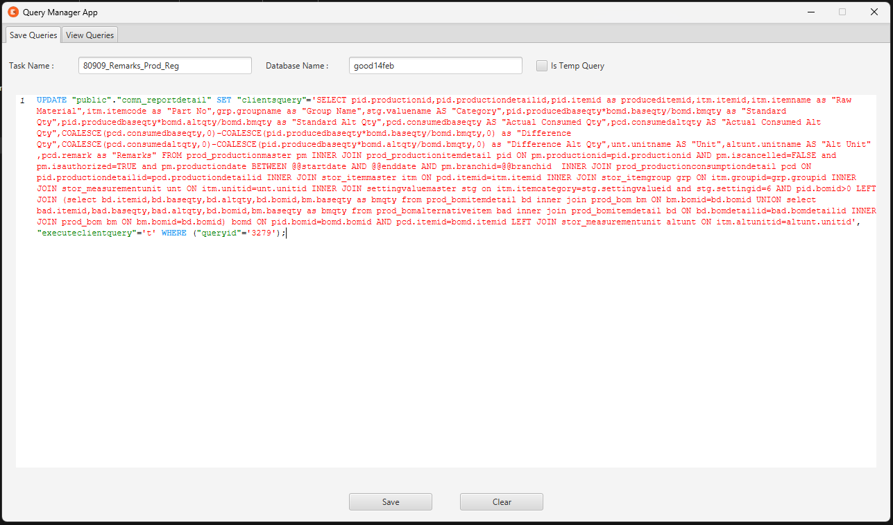
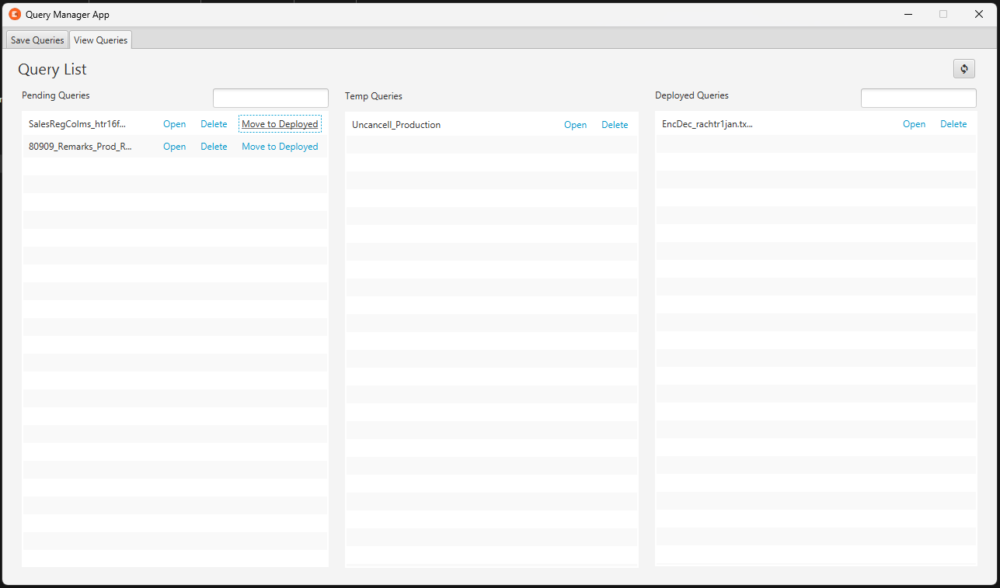
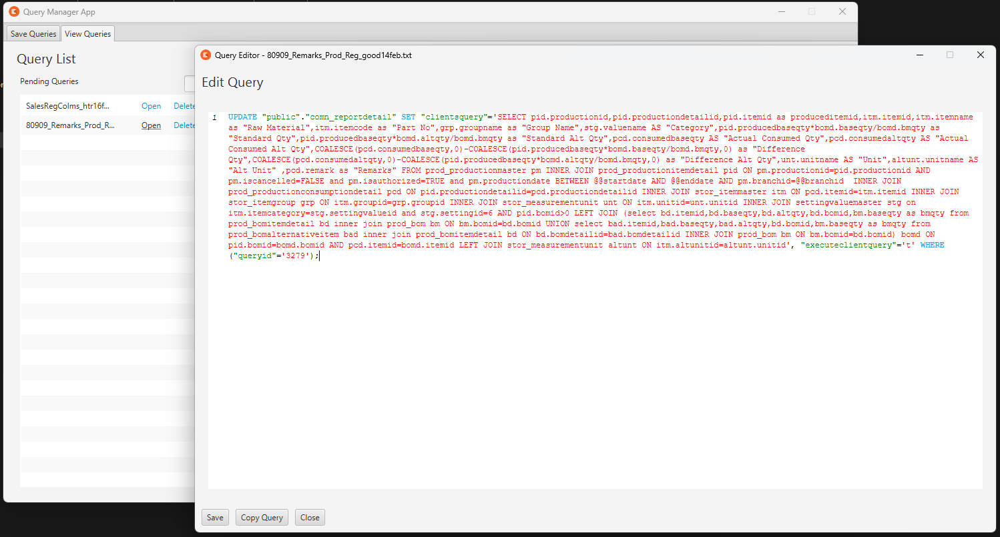

# Query Manager App

## Overview
Query Manager App is a JavaFX-based application designed for efficiently managing, organizing, and editing SQL queries. It categorizes queries into three sections and provides an IDE-like Query Editor with line numbers and syntax highlighting.

## Installation & Setup
- Download the setup file from the link
- 🔗 [WebPage For Download Link](https://porfskylord.github.io/Query_Manager/)
- 


### Prerequisites
- Nothing, everything is included in the setup file 
- Just make sure to install it in "C:\Program Files (x86)\"

## Features

### Query Management
- **Pending Queries:**  
  Queries under development or Testing are stored as TXT files.
- **Deployed Queries:**  
  Finalized or executed queries are stored as TXT files.
- **Temp Queries:**  
  Temporary queries used for testing or verification or short-term are stored in JSON format.

### Home Screen (SaveQueryController)
- **Save Queries Tab:**  
  - **Task Name & Database Name:** Input fields for query metadata.
  - **Is Temp Query Checkbox:** Mark a query as temporary.
  - **Code Editor:** A custom editor for writing SQL queries.
  - **Save/Clear Buttons:** Options to save the query or clear the input fields.
    
#### Save Queries Screen


- **View Queries Tab:**  
  - **Three Sections:**  
    - **Pending Queries:** Displays pending queries with options to open, delete, or move them to Deployed.
    - **Temp Queries:** Lists temporary queries stored in JSON format.
    - **Deployed Queries:** Shows deployed queries with management options.
  - **Search & Filter:** Each section (for Pending and Deployed) includes search functionality to quickly locate queries.
  - **Refresh Button:** Update the query lists to view the most recent changes.
    
#### View Queries Screen


### Query Editor (QueryEditorController)
- **IDE-like Editing Experience:**  
  - **Line Numbers:** Each line of the query is numbered for easy navigation.
  - **Syntax Highlighting:** SQL keywords are color-coded for better readability.
- **Editing Tools:**  
  - **Save Button:** Save modifications made to the query.
  - **Copy Query Button:** Quickly copy the query text.
  - **Close Button:** Exit the query editor.

#### Query Editor Screen



## Application Workflow

1. **Save Queries Tab:**
   - Enter the task name and database name.
   - Optionally check "Is Temp Query" if the query should be temporary.
   - Write or paste your SQL query in the editor.
   - Click **Save** to store the query (as TXT for pending/deployed or JSON for temp queries).

2. **View Queries Tab:**
   - Use the search fields to filter queries in the Pending and Deployed sections.
   - Manage queries (open, delete, move) directly from their respective lists.
   - Click the refresh button to update the lists as needed.

3. **Query Editor:**
   - Open a query from the list to view it in the editor.
   - Enjoy an IDE-like experience with line numbers and syntax highlighting.
   - Edit the query and use the provided buttons to save, copy, or close the editor.

### Clone the Repository
1. **Clone the Repository:**
   ```sh
   git clone https://github.com/porfskylord/Query_Manager.git
